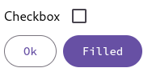

# haskell-web-material

This library contains xstatic and lucid bindings for the [material-web](https://github.com/material-components/material-web) components.

## Demo:

```haskell
import Material (materialJs, md_checkbox_, md_outlined_button_, md_filled_button_)

-- To serve the demo, see main
import Butler

demo :: Html ()
demo = with div_ [class_ "flex flex-col ml-2"] do
   with label_ [class_ "flex items-center"] do
     "Checkbox"
     md_checkbox_ mempty
   with div_ [class_ "flex gap-2"] do
     md_outlined_button_ "Ok"
     md_filled_button_ "Filled"
```

> .


```haskell
main :: IO ()
main = print =<< spawnInitProcess ".butler-storage" do
  serveApps (publicDisplayApp "Demo Material" Nothing) [htmlApp [materialJs] demo]

-- Run this demo with:
-- nix develop github:ButlerOS/haskell-butler#demo --command ghcid --command "ghci -XGHC2021 -XBlockArguments -XLambdaCase -XOverloadedRecordDot -XOverloadedStrings -pgmL markdown-unlit -package butler -package web-material ./README.lhs" -T main
```
